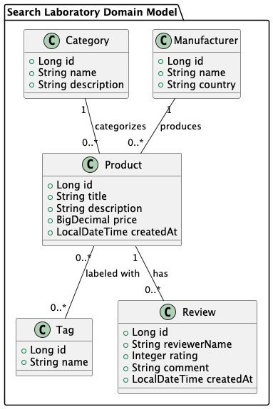

# Wad Lab 6 - Search with Postgres and Elasticsearch

## Laboratory request

Based on the following domain model:


Use:
1. Spring Data JPA for PostgreSQL access
2. Spring Data Elasticsearch
3. Implement the missing code to make the application work:
   - Create JPA entities and repositories for Product, Category, Tag, Review, and Manufacturer with the relationships from the model.
   - Create an Elasticsearch document/index mapping for Product (including category, manufacturer, tags, and reviews) and an Elasticsearch repository.
   - Implement `PostgresSearchService` and `ElasticsearchSearchService` to execute searches and map results to the provided DTOs.
   - The search query must match (case-insensitive, partial match is fine) across exactly these fields:
     - Product.title
     - Product.description
     - Category.name
     - Manufacturer.name
     - Tag.name
     - Review.reviewerName
     - Review.comment
4. Display:
- Search results
- Execution time
- Relevance score (where applicable)

# Helper tutorial

## Start the services (Postgres and Elasticsearch)
From the repo root:
```
docker compose up -d
```

## Stop the services
```
docker compose down
```

## Remove data (optional)
```
docker compose down -v
```

## Connection info
Postgres:
- Host: `localhost`
- Port: `5432`
- User: `app`
- Password: `app_password`
- Database: `app_db`

Elasticsearch:
- Host: `localhost`
- Port: `9200`

## Customize
Edit `docker-compose.yml` to change ports or credentials.
